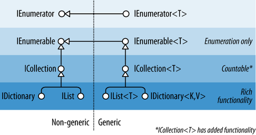

# AltoritmaTasarimi
Burada Algoritma Tasarımı Notlarım ve Uygulamalarım Bulunuyor.

## Değer Tipli Değişkenler
|Tipi|Cts tipi| Kapladığı Alan|
|---|---|---|
|byte|System Byte|8 bit işaretsiz tamsayı|
|sbyte|System Byte|8 bit işaretli tamsayı|
|short|System Int16|8 bit işaretsiz tamsayı|
|ushort|System Int16|8 bit işaretli tamsayı|
|int|System Int32|8 bit işaretsiz tamsayı|
|uint|System UInt32|8 bit işaretli tamsayı|
|long|System UInt32|8 bit işaretsiz tamsayı|
|ulong|System UInt64|8 bit işaretli tamsayı|
|float|System.Single|32 bit tek kayan sayı|
|double|System.Double|64 bit çift kayan sayı|
|decimal|System.Decimal|128 bit ondalıklı sayı|
|bool|System.Boolean||
|char|System.Char|16 bit unicode|

## Referans tipli
|Değişken Tipi|Açıklama|
|---|---|
|string|Unicode karakterleirnden oluşan string|
|object|Genel veri tipi.Tip dönüşümlerinde oluşan hatalar derleme esnasında göz ardı edilerek çalışma zamanında hata üretilir.|
|dynamic|Genel veri tipi.Tip dönüşümlerinde oluşan hatalar üzerinde derleme esnasında herhangi bir kontrol yapılmadığı için hata üretilmez|

## Var
- Değişken tanımı yapılırken tip belirtilmeden var deyimi kullanılabilir
- var ifadesi ile tanımlanan değişkenler için ilk değer ataması yapılmalıdır.
- Değişkenin tipi kullanılan veri türüne bağlı olarak C# tarafından otomatik olarak belirlenecektir.
- c# 7 versiyonu ile gelen digit seperator özelliği ile rakamları basamaklarına ayırarak daha düzenli bir şekilde yazabiliriz. örnek <code>int a = 33_000_000</code>

## GetType
- Kullanılan ya da tanımlanan veri türünün tipi almak üzere GetType deyimi kullanılır.

## Object/dynamic farkı
- object 
```Csharp
object rakam =10;
rakam = rakam + 10;
```
şeklinde bir işleme izin vermez bu kodlar hatalıdır.

- dynamic
```Csharp
dynamic rakam =10;
rakam = rakam + 10;
```
şeklinde bir kullanıma izin verir

## Kontrol İfadeleri if-else yapısı
- Programlar farklı durumlarda farklı davranışlar sergileyecek,koşulları kontrol edip duruma göre herek edilmesini sağlayacak kontrol yapılarını kullanmak kaçınılmazdır.
- Visual C# dili,kontrol ifadelerini yakalamak için Boolean türünde bir tip içerir, bu tip sayesinden kontrol ifadeleri kullanılabilir.
### Eşitlik durumları
|işleç|Anlamı|Örnek|Yas 27 ise Sonuç|
|---|---|---|---|
|==|eşittir|yas==100|False|
|!=|eşit Değildir|yas!=0|True|
|<|Küçüktür|Yas<21|False|
|<=|Küçük ya da eşit|Yas<=27|True|
|>|büyüktür|Yas>16|True|
|>=|büyük ya da eşit|Yas>=30|False|

### Koşullu mantıksal işleçler
<code>(yas>=18)&&(yas<=30)</code> ifadesinden iki koşulunda sağlanması durumunda örneğin yaş 27 ise iki koşuluda sağlar ve True değeri döner

<code>(yas>=18)||(yas<=30)</code> ifadesinde koşullardan sadece birinin gerçekleşmesi yeterlidir ikiside gerçekleşmemiş ise False dönecektir. 

## Switch Case Kavrami
- Switch durumu kendisine parametre olarak gelen kodtrol değerine bağlı olarak durum listesinden ilgili kod bloğunun çalıştırılmsı esasına dayanmaktadır.switch deyimi birden switch seçimi ile birlikte varsayılan (default)  bir seçimide içerebilir.
- Durum listesinde aynı sabit değere sahip iki durum tanımlamasının yapılmasına izin verilmez
- C#,C++ dilinin aksine break deyimi kullanılmadığı zamansırasıyla durumlar çalıştırmak yerine hata üretecektir.

## For Döngüsü
- For döngüsü kullanılarak özel bir şartın yerine gelmesi sağlanıncaya kadar belirli bir kod bloğunun çalışması sağlanabilir.For döngüsü başlangıç değeri koşul ve yineleyici bileşenlerinden oluşmaktadır.
- Öncelikle başlangıç değerinin oluşturulması ya da okunması gereklidir.Başlangıç değişkenindeki değere bağlı olarak koşul sonucu pozitif ya da bir başka ifadeyle true yani doğru ise döngüye giriş yapılır.
- Döngü tamamlanmadan önce başlangıç değeri yineleme bölümünde verilen operasyona bağlı olarak güncellenir ve daha sonra tekrar koşul ifadesine bakılır.Koşul ifadesi doğru olduğu sürece döngü çalışmaya devam edecektir.
- Döngü oluşturulurken başlangıç,koşul ve yineleme bileşenleri tek değişken olmak zorunda değildir.Birden fazla değişken ilede döngü kurulabilir.
- Özel bir şart altında istenirse break komutu ile döngünün sonlandırılması sağlanabilir yada ilgili yenileme iptal edilip bir sonraki yenileme işlemine geçmek üzere continue deyimi kullanılabilir.
- Yenileme beleşeninde ön ek (++i) ya da son ek (i++) kullanılarak atama işlemi gerçekleştirilebilir.Yineleme bileşeni arttığı gibi azaltılabilir.Döngü içerisinde yeni bir nesne tanımlanabilir. aritmetiksel ve mantıksal işlemler yapılabilir.

## Diziler
- Aynı türden/tipden verileri belirli bir kalıp dahilinde saklamak üzere kullanılan yapılar dizi (array) olarak tanımlanır.
- Diziler tanımlanırken kaç elemean depolayacağı ve boyutu genellikle tanımlama esnasında bildirilir.
- Diziler üzerindeki her bir elemana erişmek üzere indis değerleri kullanılır.
- Tek boyut bir dizi tanımlandığında hafızada dizinin tanımlandıı veri türüne bağlı olarak eşit uzunluklara sahip gözler açılır.
- Her bir gözün, yani dizi elemanı için ayrılmış alanın,bir adresi ve indis değeri vardır.
### Tek Boyutlu Diziler
- **Tanımlama şekilleri**<br>
    Aşağıda 5 tane tam sayı tutacak bir dizi tanımı gerçekleştiriliyor 
    ```c#
    int[] array = new int[5];
    ```
    Bu dizinin elemanları array[0] ve array[4] aralığında yer alır.yani indis değeri 0 ile başlar

    Dizi tanımlama (decleration) aşamasında dizi uzunluğu belirtmeden dizi tanımlamak mümkündür.
    ```c#
    int[] array1= new int[] { 1, 2, 3, 4, 5, 6};
    ```
    Burada zaten virgül ile ayrılmış elemanların sayısı dizi uzunluğu temsil etmektedir.

    Dizi oluşturma aşamasında eğer değerler atanıyorsa tanımlama ifadesi kısaltılabilir.
    ```c#
    int[] array2 = {1, 2, 3, 4, 5, 6, 7};
    string[] weekDays2 = { "Sun", "Mon", "Tue", "Wed", "Thu", "Fri", "Sat"};
    ```
    Görüldüğü üzere new anahtar kelimesini kullanılmasına gerek kalmamıştır.

    - Dizi oluşturma aşaması dışında da tanımlanabilir bu durumda  new anahtar kelimesi kullanılmalıdır.
    ```c#
    int[] array3;
    array3 = new int[] { 1, 2, 3, 4, 5, 7, 8} // bu kod çalışır
    array3 = { 1, 2, 3, 4, 5, 7, 8} // bu kod hata verir ve çalışmaz. 
    ```
### Çok Boyutlu Diziler(Multidimensional Array)
- **Tanımlama Şekilleri**<br>
    Aşağıdaki deklarasyonda 4 satır ve 2 sütundan oluşan bir dizi tanımı gerçekleştirilmiştir.
    ```c#
    int[,] array = new int[4,2];
    ```
    Diziler birden fazla boyuta sahip olabilmektedir.

## Stringler
- String nesnesinin değeri System.Char nesnelerinin sıralı koleksiyonunun içerisidir ve bu değer sabittir(yani salt okunurdur).
- Bellekteki String nesnesinin en büyük boyutu 2 GB veya yaklaşık 1.000.000.000 karakterdir.
- String ifadeleri metinleri temsil etmek üzere kullanılan ardışık bir karakter koleksiyonudur.
- String nesnesi bir diziyi temsil eden System.Char nesnelerinden oluşan sıralı bir koleksiyondur.
- c# ters eğik çizgi (\) bir kaçış karakteri olduğundan bir dizedeki değişmez değer ters eğik çizgilerden çıkarılmalıdır ve dizenin tamamının @-quoted olması gerekir.
    ```c#
    string string1 = "This is a string created by assignment";
    Console.WriteLine(string1);
    string string2a = "The path is C:\\PublicDocuments\\Report1.dox";
    Console.WriteLine(string2a);
    string string2b = @"The path is C:\PublicDocuments\Report1.dox";
    Console.WriteLine(string2b);
    // The example displays the following output:
    //      This is a string created by assignment
    //      The path is C:\PublicDocuments\Report1.doc
    //      The path is C:\PublicDocuments\Report1.doc
    ```
### String Oluşturma
```c#
char[] chars = { 'w', 'o', 'r', 'd' };
sbyte[] bytes = { 0x41, 0x42, 0x43, 0x44, 0x45, 0x00 };

// Create a string from a character array.
string string1 = new string(chars);
Console.WriteLine(string1);

// Create a string that consists of a character repeated 20 times.
string string2 = new string('c', 20);
Console.WriteLine(string2);

string stringFromBytes = null;
string stringFromChars = null;
unsafe
{
   fixed (sbyte* pbytes = bytes)
   {
      // Create a string from a pointer to a signed byte array.
      stringFromBytes = new string(pbytes);
   }
   fixed (char* pchars = chars)
   {
      // Create a string from a pointer to a character array.
      stringFromChars = new string(pchars);
   }
}
Console.WriteLine(stringFromBytes);
Console.WriteLine(stringFromChars);
// The example displays the following output:
//       word
//       cccccccccccccccccccc
//       ABCDE
//       word
```
### String Birleştirme
```c#
string string1 = "Today is " + DateTime.Now.ToString("D") + ".";
Console.WriteLine(string1);

string string2 = "This is one sentence. " + "This is a second. ";
string2 += "This is a third sentence.";
Console.WriteLine(string2);
// The example displays output like the following:
//    Today is Tuesday, July 06, 2011.
//    This is one sentence. This is a second. This is a third sentence.
```
### String Ayıklama
- String ifadeleirnde,örnek bir alt dize, daha büyük bir ifadeden ayıklanabilir.
```c#
string sentence = "This sentence has five words.";
// Extract the second word.
int startPosition = sentence.IndexOf(" ") + 1;
string word2 = sentence.Substring(startPosition,
                                  sentence.IndexOf(" ", startPosition) - startPosition);
Console.WriteLine("Second word: " + word2);
// The example displays the following output:
//       Second word: sentence
```
### String Dönüşümü
- Farklı veri tipleri string gösterimine dönüştürülebilir.
```c#
DateTime dateAndTime = new DateTime(2011, 7, 6, 7, 32, 0);
double temperature = 68.3;
string result = String.Format("At {0:t} on {0:D}, the temperature was {1:F1} degrees Fahrenheit.",
                              dateAndTime, temperature);
Console.WriteLine(result);
// The example displays the following output:
//       At 7:32 AM on Wednesday, July 06, 2011, the temperature was 68.3 degrees Fahrenheit.
```
### UTF-16
- Bir dizdeki her karakter,Unicode kod noktası olarak da bilinen Unicode skaler değeri veya Unicode karakterinin Ordinal(Sayısal) değeri tarafından tanımlanır.
- Her kod noktası UTF-16 kodlaması kullanılarak kodlanır ve kodlamadaki her öğenin sayısal değeri Char nesnesi ile temsil edilir.
### Dizeler ve Dizinler
- Dizin **String**'de bir **Char** nesnesinin konumudur(Unicode karakteri değil)
- Dizin, dizin konumu sıfır olan dizedeki ilk konumdan başlayan sıfır tabanlı, negatif olmayan bir sayıdır.
- **IndexOf** ve **LastIndexOf** gibi çeşitli arama yöntemleri dize örneğindeki bir karakter veya alt dizenin dizinini döndürür.
- **Chars[Int32] :** özelliği tek tek **Char** nesnelerine dizedeki dizin konumlarına göre erişmenizi sağlar.
- **Chars[Int32] :** özelliği varsayılan Özellik (Visual Basic) veya Dizin Oluşturucu (içinde C#) olduğundan,aşağıdaki gibi bir kod kullanarak bir dizedeki bireysel **Char** nesnelerine erişilebilir.
- Bu kod, dizenin kaç sözcükten oluşan sözcükleri belirlemekte bir dizedeki boşluk veya noktalama karakterleri arar.
```c#
string s1 = "This string consists of a single short sentence.";
int nWords = 0;

s1 = s1.Trim();      
for (int ctr = 0; ctr < s1.Length; ctr++) {
   if (Char.IsPunctuation(s1[ctr]) | Char.IsWhiteSpace(s1[ctr]))
      nWords++;              
}
Console.WriteLine("The sentence\n   {0}\nhas {1} words.",
                  s1, nWords);                                                                     
// The example displays the following output:
//       The sentence
//          This string consists of a single short sentence.
//       has 8 words.
```
### Null diziler ve Boş diziler
- Tanımlanan ancak atanmamış birdize null'dır.
- Bu dize üzerinde yöntem çağırma girişimi bir **NullReferenceException** oluşturur.
- **Null** dize, değeri "" veya **String.Empty** olan bir dize olan boş bir dizeden farklıdır.
- Bazı durumlarda, bir null dize veya boş bir dizeyi bir yöntem çağrısında bağımsız değişken olarak geçirmek özel durum oluşturur.
Örneğin **Int32.Parse** metoduna null bir dize geçirmek bir **ArgumentNullException** oluşturur ve boş bir dizeyi geçirmek bir **FormatException** oluşturur.
- Diğer durumlarda,bir yöntem bağımsız değişkeni bir null dize veya boş bir dize olabilir.Örneğin bir sınıf için IFormattable uygulama belirtecisine eşit olacak şekilde kullanmak istersiniz.
- **isNullOrEmpty(String) :** bir dizenin **null** veya String.Empty eşit olup olmadığını gösterir.Bu yöntem aşağıdaki gibi kod kullanma gereksinimini ortadan kaldırır.
```c#
if(str == null || str.Equals(String.Empty))
```
- **isNullOrWhiteSpace(string) :** bir dizenin **null**,eşit String.Empty veya yalnızca boşluk karakterlerinden oluşan bir değer olup olmadığını gösterir.Bu yöntem aşağıdaki gibi kod kullanma gereksinimini ortadan kaldırır:
```c#
if(str == null || str.Equal(String.Empty) || str.Trim().Equals(String.Empty))
```
- **isNUllOrWhiteSpace(string) :**
```c#
if (str == null || str.Equals(String.Empty) || str.Trim().Equals(String.Empty))
```
## StreamReader,StreamWriter,FileStream
### StreamReader
- Verilerin belirli bir formatta bir dosyaya yazılması,onların kalıcı belleğe aktarılması anlamına gelir.
- Kalıcı belleğe aktarılan veriler ihtiyaç duyulması halinde okunabilir,güncellenebili yada tamamen silinebilir.
- Dosyadan okuma yapmak için StreamReader nesnesi kullanılabilir.
- Bu nesne tanımlandığında  okunacak dosyanın fiziksel konum bilgisini de parametre olarak almalıdır.
- Dosyalama işlemlerinin bir try-catch bloğu içinde yapılması etkili hata yönetimi için tavsiye edilmektedir.
### StreamWriter
- Bir dosyaya yazma yapmak için StreamWriter nesnesi kullanılabilir.
- Bu nesne tanımlandığında  okunacak dosyanın fiziksel konum bilgisini de parametre olarak almalıdır.
- Dosyalama işlemlerinin bir try-catch bloğu içinde yapılması etkili hata yönetimi için tavsiye edilmektedir.

### FileStream
- FileStream sınıfı Stream sınıfından kalıtım tekniğiyle türetilmiş bir sınıftır.
```c#
FileStream fs = new FileStream(dosyayol,
FileMode.Append,
FileAccess.Write,
FileShare.Note);
```
- FileStream tanımı yapılırken:
   - FileMode: (Create,CreateNew,Append,Open,OpenOrCreate,Truncate)
   - FileAccess: (Read,Write,ReadWrite)
   - FileShare: (None,Read,Write,ReadWrite) belitilebilir.
- FileStream tanımına bağlı olarak yazma ve okuma gibi yetkilerin olup olmadığı kontrol edilebilir.
```c#
//fs.canRead,canWrite, ... 
if(fs.canRead){
   ...
}
```
- Açılan bir FileStream nesnesi için kapatma işlemi uygulanmalıdır ki yazma işlemi gerçekleşebilsin.
```c#
// yazma islemini tamamlamak için gereklidir.
fs.Close();
```
## OOP (Object Oriented Programing)
C# saf bir nesne yönelimli programlama dili değildir. C# çoklu programlama paradigmasına da aynı zamanda dayanmaktadır, fonksiyonel programlamayıda desteklemektedir.Ancak nesne yönelimli programlama c# için önemli bir kavramdır ve c# tarafından önerilen tüm kütüphaneler için çekirdek/temel bir kavramdır.

### Temel Kavramları
1. Abstraction
2. Encapsulation
3. Inheritance
4. Polymorphism

### Classes
- Sınıflar çeşitli standart ve özel üyeler içerir.
- Bazen bu üyeler static de olabilir.
- Bir sınıfa ait üye eğer static deyimi ile tanımlanmış ise sınıfın bir örneğinin türetilmesine gerek kalmadan doğrudan sınıf üzerinden çağrılabilir.
- Bir başka ifadeyle bir static üye sınıfa aitken; diğer örnekler üye nesneye aittir.Bir static alan için alanın değeri tüm nesneler için aynıdır.Ancak bir örnek alanı için nesne farklı bir değere sahiptir.
#### Partial Class
- **Partial** anahtar kelimesi class,struct,method yada interface gibi yapıların birden çok dosyaya yayılmasına izin verir.
- **örnekler**
   ```c#
   namespace AlgoritmaTasarimi
   {
      partial class Veri
      {
         public Veri(string veri)
         {

         }
      }
   }
   ```
   **veri1.cs**
   ```c#
   using AlgoritmaTasarimi;

   namespace AlgoritmaTasarimi
   {
      partial class Veri
      {
         public Veri(string veri,string veri2)
         {

         }
      }
   }
   ```
   **veri2.cs**<br>
   örneklerde görüldüğü gibi aynı namespace içerisinde farklı dosyalarda tanımlanmış ve aynı class ismine ve **partial** tanımlamalarına sahip class yapıları çalışırken tek bir class,tek bir dosya gibi davranırlar.bunun için `using AlgoritmaTasarimi` şeklinde namespace'leri birbirlerinin içlerine dahil etmek gerekir.Bu yapı bize classları tasarlarken ve kullanılanırken esneklik sağlar.
   
### Class Members
#### 1. Fields
   - Alanlar (fields) kabaca sınıfla ilişkili olan değişkenleri temsil ederler ve private düzenleyicisi ile kullanılırlar.
   - Alanlara eklenen iki özel fonksiyon ise Property oluşturmak için kullanılır.
   - Bu fonksiyonlar yazma ve okuma işleminin yapılmasını sağlayan set ve get metotlarıdır.
   ```c#
   public class Musteri
   {
      private string _adi;
      public string Adi{
         get{
            return _adi;
         }
         set{
            _adi =value;
         }
      }
   }
   ```
   **Expression-bodied property**
   ```c#
   public class Musteri
   {
      private string _adi;
      public string Adi
      {
         get => _adi;
         set => _adi = value;
      }
   }
   ```
   - **Auto-Implemented Property**
      - Eğer property'nin erişimcileri olan set ve get metotları içerisinde herhangi bir mantık/kural yok ise bu durumda auto-implemented property kullanılabilir.
      - Burada özel bir alanın (field) tanımlanmasına gerek yoktur.
      - Derleyici bunu otomatik olarak yapabilmektedir.
      - Bu durumda, auto-implemented properties ile tanımlanmış bir peroperty'nin ilgili alanına derleyicinin oluşturduğu otomatik ismi bilmediğiniz sürece erişemezsiniz.
      ```c#
      public class Musteri
      {
         private string _adi;
         public string Adi
         {
            get => _adi;
            set => _adi = value;
         }
         public int Yas 
         {
            get;
            set;
         }
      }
      ```
   - **Abstraction**
      - Bu örnekte bir öğrencinin notunun yazma sırasında 0'dan küçük ve 100'den büyük olma durumu set ve get erişimcilerinin içerisinde engellenmiştir.Böyle bir durumda kullanılan _not alanı yada bir başka ifadeyle _not değişkeni Not property için destek değişkeni(backing variable) olarak isimlendirilir.
         ```c#
         public class Ogrenci
         {
            public int Not
            {
               get
               {
                  if (_not > 100)
                     return 100;
                  else if (_not < 0)
                     return 0;
                  else
                     return _not;
               }
               set
               {
                  if (_not > 100)
                     _not =_100;
                  else if (_not < 0)
                     _not = 0;
                  else
                     _not = value;
               }
            }
         }
         ```
   - **Property Accessors**
      - c# set ve get erişimcileri için farklı düzenleyiciler sunar.Bu bir property için public olarak yada private olarak yazma okuma işlemlerinin yapılabileceği anlamına gelir.
      ```c#
      public class Ogrenci
      {
         private string _adi;
         public string Adi
         {
            get => _adi;
            private set => _adi= value;
         }
      }
      ```
   - **Readonly Property**
      - lambda expression ifadesiyle sadece get properties tanımlanmış `_adi` fields sadece okuma işlemi için kullanılabilir, bir değer tanımlandı ise dışarıdan değiştirilemez.
      - Benzer şekilde sadece yazılabilir bir perperty de get özelliği devre dışı bırakılarak oluşturulabilir.
      - Fakat böyle bir tanımlama çok anlamlı olmayacaktır.
      - Böyle bir durumda sadece yazılabilir bir özellik tanımlamaktansa metot kullanımı daha doğru bir yaklaşım olacaktır. 
      ```c#
      public class Ogrenci
      {
         private string _adi;
         public string Adi
         {
            get => _adi;
         }
      }
      ```
   - **Auto-Implemented Read-Only Properties**
      - c# sadece okunabilir değişkenleri tanımlamak için Auto-Implemented Read-Only Properties niteliği de sunmaktadır.
      ```c#
      public class Ogrenci
      {
         public string Id { get; } = Guid.NewGuid().ToString();
      }
      ```
   - **Expression-bodied Method**
      - c# dilinde expression-bodied method niteliği expression-bodied property içinde geçerlidir.
      - Bu durumda return deyiminin kullanılmasına gerek kalmamaktadır.
      - Aynı zamanda get anahtar sözcüğü de bu durumda kullanılmayabilir.
      - Lambda ifadesiyle tanım kolayca gerçekleştirilebilir.
      ```c#
      public class Kisi
      {
         public Kisi(string adi,string soyadi)
         {
            Adi = adi;
            Soyadi = soyadi;
         }
         public string Adi { get; }
         public string Soyadi { get; }
         public string AdiSoyadi => $"{Adi} {Soyadi}";
      }
      ```
   - **Anonymous Types**
      -  Anonim türler genellikle var anahtar sözcüğü ile tanımlanır.
      - var sözcüğü new anahtar kelimesiyle birlikte kullanıldığında bir anonymous type tanımı gerçekleştirilir.
      ```c#
      static void Main(string[] args)
      {
         var Araba = new
         {
            Marka = "Skoda",
            Model = 2019,
            Renk = "Gri"
         };
         Console.WriteLine(Araba.ToString()); 
      }
      ```
#### 2. Constant
#### 3. Methods
   - c# terminolojisi metotlar ve fonksiyonlar arasında küçük bir farklılığa sahiptir.c# terminolojisinde `işlem üyesi - function member` terimi sadece yöntemleri değil aynı zamanda bir sınıfın veya yapının diğer veri olmayan (nondata) üyelerini de içerir.Bu indeksler (indexer), operatörler (operators), yapılandırıcılar (constructors), yok ediciler(deconstructors) ve belki özellikleri kapsayabilir.
   - Eğer bir metodun uygulanması sadece bir deyimi içeriyorsa c# bunun için basit bir söz dizilimi sağlar ve bu dizilim Expression-bodied methods olarak ifade edilir.Bu durumda süslü parantezler,`return` deyimi gibi ifadelerin kullanılmasına gerek kalmaz.`=>` operatörü ifadenin sol ve sağ taraflarının birbirinden ayrılmasını sağlar.
   **syntax**
   ```
   [modifiers] return_type MethodName([parameters])
   {
      // method body
   }
   ```
   - **Expression-bodied method**
      - **klasik metod tanımı**
      ```c#
      public bool KareMi(int x,int y)
      {
         return (x == y);
      }
      ```
      - **expression-bodied methods uygulaması**
      ```c#
      public bool KareMi(int x,int y) => x==y;
      ```
   - **Method overloading**
   - c# methodların aşırı yüklenmesi (method overloading) destekler
   - bir metodun farklı imzalar taşıyan versiyonları var ise ilgili metodun aşırı yüklendiği ifade edilir.
   - **expression-bodied method şeklinde bir metod üç tane overloading yapısı**
      ```c#
      public bool EsitMi(int x, int y) => x == y;
      public bool EsitMi(double x, double y) => x == y;
      public bool EsitMi(string x, string y) => x.Equals(y);
      ```
   - **Optional arguments**
      - Metot tanımlarında parametreler bazen tercihe bağlı olarak sunulabilir
      - Bu durumda ilgili parametreler için varsayılan değerler tanımlanması gerçekleştirilebilir.
      - 
         ```c#
         public bool EsitMi(int x=1, int y=1) => x == y;
         public bool EsitMi(string x="true", string y="true") => x.Equals(y);
         ```
   - **Extension Method**
      - Bir sınıfı genişletmenin yollarından birisi extension methods kullanımıdır.
      - Kalıtım(inheritance) bir uygulamaya fonksiyonellik kazandıran yöntemlerden biridir, buna alternatif olarak veya kalıtım kullanılmadığında extension methods lar kullanabilir.
      - Extension method kullanımı da yine bir sınıfı genişletmek için tercih edilebilecek yollar arasındadır.
      - Extension methods'lar sınıfın kaynak kodunda bulunmayadan bir sınıfın parçası gibi görünebilen static yöntemlerdir.
      - Derleyici **this** anahtar kelimesiyle özel bir tür için extension method yazıldığını anlayabilmektedir.
         ```c#
         public static class StringExtension
         {
            public static int KelimeSayisi(this string s) => s.Split().Length;
         }
         internal class Program
         {
            private static void Main(string[] args)
            {
               string metin = "merhaba dünya";

               Console.WriteLine($"{metin.KelimeSayisi()}");
            }
         }
         ```
   - **Virtual Methods**
      - virtual olarak bildirilmiş bir temel sınıf (base class) metodu,
      temel sınıftan türetilen sınıflarda overriden(ezilebilir, gereçsiz kılınabilir) edilebilir, bu izin ilgili metot için verilir.
      - Virtual anahtar kelimesi metotlar için kullanılabildiği gibi property'ler için de kullanılabilir.
      - Temel bir sınıfın metotları override edildiğinde metotların imzaları ve geri dönüş türleri olduğu gibi eşleşmelidir.
      - Fields ve static fonksiyonlar virtual olarak tanımlanmaz.
      - kalıtım bir bir sınıftan türetilen bir sınıfın türetildiği sınıftan gelen bir metodu override edebilmesi kendisine has bir override metodu yazabilmesi türetildiği sınıfta metod virtual olarak tanımlamış olması gereklidir.
      ```c#
      public virtual void Ciz() => Console.WriteLine($"Sekil {Pozisyon} - {Boyut}");
      ```
   - **Polymorphism**
      - Polimorfizmde çağrılan yöntem derleme zamanı sırasında değil , çalışma zamanında dinamik olarak tanımlanır.
      - Derleyici bir sanal metot tablosu (vtable) oluşturur ki bu tablo çalışma zamanı sırasında çağrılabilecek metotların bir listesini içerir ve derleyici çalışma zamanında type (tip) dikkate alarak ilgili metotları çağırır.
   - **Calling Base Version of Methods**
      - c# temel sınıfta yer alan bir metodu çağırmak üzere özel bir söz dizilimine sahiptir.
      `base.<MethodName>`
      - Bu şekilde herhangi bir metodu override etmeden temel sınıftan çağırmak mümkündür.
   - **Abstract Classes and Methods**
      - c# sınıf ve metotların abstract olarak tanımlanmasına izin verir.
      - Soyut bir sınıf somutlaştırılamaz.
      - Yani abstract bir sınıftan yeni sınıflar türetilebilir ancak nesne üretilemez.
      - Eğer bir metot abstract anahtar sözcüğü ile tanımlanış ise implementation(uygulaması yani gövdesi) yoktur implementation türtilen sınıf içerisinde override edilirken oluşturulur. abstract olmayan bir sınıfta override edilmesi gerekir bu bir zorunluluktur.
      - Bir abstract metot otomatik olarak zaten virtual deyimine sahip olmuş oluyor ve tekrar virtual anahtar sözcüğünün tanımlanma noktasında kullanılması gerekmez.
      - Eğer bir sınıf abstract bir metot içeriyorsa, sınıf tanımında da abstract deyimi kullanılmalıdır.
   - **Sealed Classes and Methods**
      - Bir sınıftan yeni sınıflar türetilmesi engellenmek istendiğinde bu sınıf `sealed` anahtar sözcüğü ile tanımlanmalıdır.
      - sealed anahtar sözcüğünün bir sınıfa eklenmesi bu sınıftan artık alt sınıfların üretilemeyeceği/türetilemeyeceği anlamına gelir.
      - sealed anahtar sözcüğü bir metoda eklendiği zaman ise bu artık ilgili metodun override edilemeyeceğini ifade eder.
      - sealed anahtar sözcüğü bu kapsamda mühürleme - kapatma şeklinde algılanabilir.
      - Kod parçası üzerinden yapılacak türetmelere bağlı olarak yürütülecek işlemlerde hataların ortaya çıkma ihtimali söz konusu olduğunda bu anahtar sözcük kullanılabilir.
      - sealed class kullanımının nedenlerinden birisi bir sealed class tanımlandığında derleyici bilir ki ilgili sınıftan türetme yapmak engellenmiştir.Derleyici tarafından oluşturulan sanal tabloda sanal metotlar azaltılabilir ve elemine edilebilir.
      - Bu durumda performansta bir artış sağlanacaktır.
      - örneğin string sınıfı sealed class'tır.Bu sınıfın sealed yapılarak olası en yüksek performası sağlaması hedeflenmiştir.
      - Peki yinede biz bu class ı genişletmek istersek extension metotlar ve this ifadesi kullanılabilir.
#### 4. Properties
#### 5. Constructor
   - Temel Yapılandırıcıların bildirilmesi için söz dizilimi de bir metot gibidir.
   - Yapılandırıcı metot adı sınıf adı ile aynı olmalıdır.
   - Bir yapılandırıcı metodun geri dönüş tipi aslında sınıfın kendisini ifade ettiğinden geri dönüş tipi belirtilmez.
   - Yapılandırıcı metotlar da aşırı yüklenebilir.
   - Yapılandırıcı metotlar sınıfın bir örneği oluşturulduğunda otomatik olarak çalışırlar.
   - Yapılandırıcı metot için access modifier ifadelerinin kullanımı anlamsızdır. çünkü zaten bu constructor kullanıldığında bir nesne oluşturuluyor ve bu nesne üzerinden erişim sağlanıyor ve fields'ler de zaten access modifier tanımları yer alıyor yani access modifier kullanımı bu kısımda bu yüzden anlamsız olmuş oluyor.
   - **expression-bodied with constructor örneği**
      ```c#
      class Kisi
      {
         Kisi(string adi) => Adi = adi;
      }
      ```
   - Eğer bir yapılandırıcı method sadece tek bir ifadeden oluşuyorsa yapılandırıcı metot expression-bodied şeklinde uygulanabilir.
   - Constructor yapısıyla ilgili olarak bir diğer konu türetilmiş sınıflarda (inheritance) constructor yapısının kullanılmasıdır;bu durumda hiyerarşik bir yol izlenir.
   - **Constructors of Derived Classes**
      - Burada en önemli ve dikkat çekici nokta bir hiyerarşiye sahip olan yani başka bir sınıftan türetilmiş olan sınıfların yapılandırıcılarının nasıl çalıştığıdır.
      - Bir sınıftan türetilmiş olan sınıf içni yapılandırıcı yazıldığında yapılandırıcının kontrolü ele alınır.
      - Birden başka ifadeyle,türetilmiş bir sınıftan bir nesne üretildiğinde birden fazla yapılandırıcının çalışağınında farkında olmak gerekir.
      - Türetilmiş sınıf aynı zamanda base class'ın da yapılandırıcı metodunu çağıracaktır.
      - Türetilmiş sınıflardan bir nesne üretildiğinde ilk olarak `object` yapılandırıcısı çalışacaktır ve hiyerarşi aşağıya doğru takip edilecektir.
      - Her yapılandırıcı kendi alanları (fields) üzerinde işlem gerçekleştirecektir.
      - üst sınıflardaki constructorları override etmek için alt sınıfta tanımlalan örnek constructor yapısı
         ```c#
         //base class taki contructor ezilmiş oldu
        public Dikdortgen(int genislik, int yukseklik, int x, int y) : base(genislik-5, yukseklik-5, x-2, y-6)
        {
            Console.WriteLine("Derived class -> ctor - 4p");
        }
         ```
#### 6. Indexer
#### 7. Operators
#### 8. Events
#### 9. Destructors
#### 10. Types


### interfaces
- Bir interface yapısında sınıf türetmek daha önce imzası tanımlanmış olan metotların implemente edilmesi anlamına gelir. Tüm nesne yönelimli diller inteface yapısını desteklemez.Genel olarak interface yapısı sadece methods,properties,indexer ve events'ların deklarayonunu içerir.
- Bir abstract sınıf implementasyonlar veya implementasyonu olmayan üyeler içerir.
- Ancak interface yapısı, hehangi bir implementasyon içermez,yani tamamen soyuttur.
- Çünkü interface yapısının üyeleri her zaman abstract şeklinde tanımlanır.
- Bununla birlikte abstract deyimi interface için gerekli değildir.
- Abstract sınıflarda olduğu gibi interface üzerinden somutlaştırma,yani nesne üretme, yapılamaz.
- interface yapısı sadece iyelerinin imzalarını taşır.
- interface yapısı ne constructor nede field üyelerine sahip değildir.
- interface yapısı operatör aşırı yükleme (operator overloading) yapısına da izin vermez.
- access modifier kullanımına izin verilmez
- interface iyeleri her zaman pubic olarak tanımlanır ve virtual olarak deklare edilemezler.
- İnterface tanımlanırken ismi büyük "I" harfi ile başlamalıdır.Bu bir yaklaşım yani "I" harfi olmak zorunda değil ancak interfece olduğunun anlaşılması için bu yaklaşım benimsenmiş durumda.
### Types of inheritance
#### Single inheritance
Bir sınıftan başka bir sınıfın türetilmesidir.örnek arac,taşıt uygulaması
#### Multiple inheritance
Bir sınıfın birden fazla temel sınıftan üretilmesidir.c# multiple inheritance sınıflar için desteklemez ancak interface yapıları için buna izin verir.
#### Multilevel inheritance
Bir sınıftan türetilen sınıftan başka bir sınıfın daha türetilmesidir.Hiyerarşik bir şekilde kalıtımın yapılmsıdır.c# multilevel inheritance desteklemekte ve sıklıkla kullanmaktadır.
#### İnterface inheritance
interface inheritance kalıtımın interface yapısı ile uygulanmasını ifade eder.Buna multiple inheritance mümkündür.

## Collections
